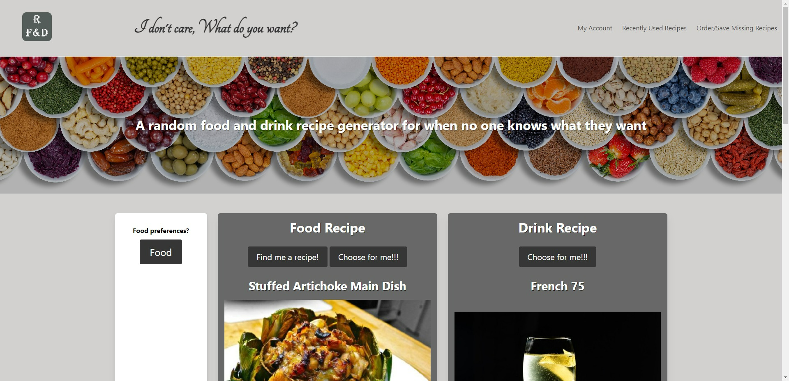

# IDCWDYW-Food-and-Beverage-Recipe-Generator
I don't care, what do you want - a food and beverage recipe generator for when no one knows what they want!
​
Features for my project:
-----------------------------------------------------------------------
​
The point of this website is to give users options for food and drink recipes when things are hard to figure out. The website will prevent many unnecessary arguments and solve problems like indecisiveness between users. To use the website just simply click on our choose for me button on either our Food or drink side of our website. If you have any preferences that you want to include, go to the left side of the page and you will see food preferences. Click the food button and check off any thing that you want to add. Afterwards click find me a recipe and then your recipe will show.
​
Links
-----------------------------------------------------------------------
# [Deployed Website](https://thedanbrown.github.io/Daily-Schedule-Calender/)
# [Repository](https://github.com/Thedanbrown/IDCWDYW-Food-and-Beverage-Recipe-Generator)

 

Usage:
-----------------------------------------------------------------------
once deployed, the webpage can be viewed in a traditional browser.
​
Built with
-----------------------------------------------------------------------
Html
Css
Javascript
bulma css framework
​
Api's used:
-----------------------------------------------------------------------
​# [Spoonacular API](https://spoonacular.com/food-api/)
​# [The CocktailDB](https://www.thecocktaildb.com/api/)

Collaborators:
​# [GuiltyGamingJay](https://github.com/GuiltyGamingJay)
​# [Micky-Ad](https://github.com/Micky-Ad)
​# [Kevin Roman](https://github.com/KevinRoman03)

​License:

MIT License

Copyright (c) [2022] [Daniel Brown]

Permission is hereby granted, free of charge, to any person obtaining a copy of this software and associated documentation files (the "Software"), to deal in the Software without restriction, including without limitation the rights to use, copy, modify, merge, publish, distribute, sublicense, and/or sell copies of the Software, and to permit persons to whom the Software is furnished to do so, subject to the following conditions:

The above copyright notice and this permission notice shall be included in all copies or substantial portions of the Software.

THE SOFTWARE IS PROVIDED "AS IS", WITHOUT WARRANTY OF ANY KIND, EXPRESS OR IMPLIED, INCLUDING BUT NOT LIMITED TO THE WARRANTIES OF MERCHANTABILITY, FITNESS FOR A PARTICULAR PURPOSE AND NONINFRINGEMENT. IN NO EVENT SHALL THE AUTHORS OR COPYRIGHT HOLDERS BE LIABLE FOR ANY CLAIM, DAMAGES OR OTHER LIABILITY, WHETHER IN AN ACTION OF CONTRACT, TORT OR OTHERWISE, ARISING FROM, OUT OF OR IN CONNECTION WITH THE SOFTWARE OR THE USE OR OTHER DEALINGS IN THE SOFTWARE.